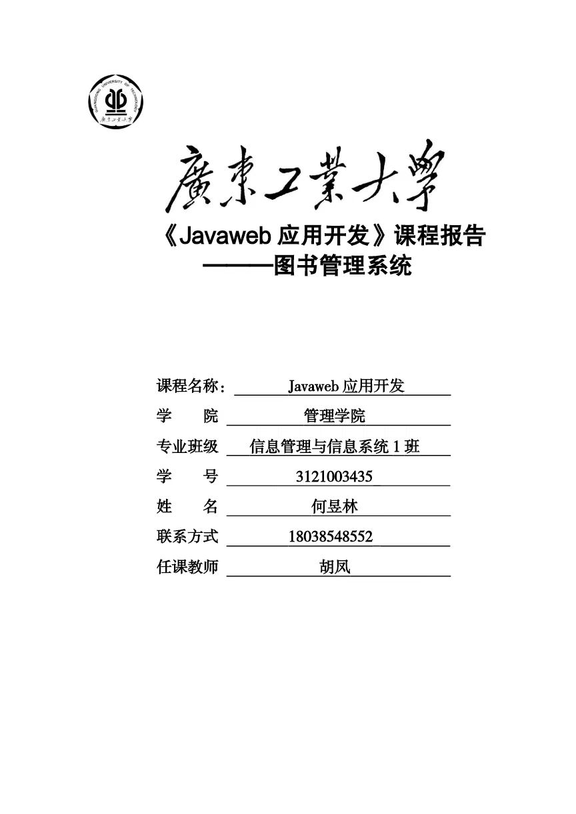

# 1. 系统简介 
## 1.1. 项目背景
系统现状：目前，图书管理系统使用的是传统的纸质图书登记簿，如果要查询某本书的状态，如是否借出或者是否丢失，则需要手动查询每一本书的记录，效率低下，不利于图书管理工作。
  
要解决的主要问题：
为了提高图书管理工作的效率，解决传统的纸质图书登记簿的缺点，需要建立一个高效的图书管理系统，能够快速查询某本书的状态，以及可以实现图书的借阅、归还等功能。
## 1.2. 主要功能模块介绍
1. 读者管理模块：
   - 支持新读者的注册。
   - 支持读者基本信息的修改和查询，以维护读者数据库的准确性和完整性。

2. 图书管理模块：
   - 支持图书详细信息的录入和编辑，包括书名，作者，出版社，ISBN 等，以及相关的分类标签，如文学、历史等。
   - 同时支持库存量、现库存的统计，并能及时更新总馆藏图书数的统计信息。
   - 搜索功能应支持多元化的查询方式，如关键词、分类、作者、出版社等等。

3. 借阅管理模块：
   - 支持读者借阅操作，且在借出贸然前，进行读者的规范性身份确认。
   - 及时记录图书借还情况，并对空缺和过量的图书进行统计和分析，在确保读者基本权益的同时，调动馆藏资源的有效性。

4. 管理人员管理模块：
   - 支持管理员信息的添加，包括姓名、账号、密码等登陆信息。
   - 按照当地司法规定与行业监管要求建立相应的权限角色和管理制度，以防范黑客、欺诈、泄密等恶意行为，确保系统安全性。

# 2. 开发环境及配置
## 2.1. 环境配置
本课题使用了Java开发平台进行Web应用程序的开发，其中包括以下软件和工具：

JDK 17、Tomcat 9.0.75、IntelliJ IDEA 2022.3、MySQL 8.0.31、Maven 3.6.3


所有软件都是在Windows 10操作系统下安装和运行的
## 2.2. 开发模式
整个项目都是基于三层架构模式开发的，在数据访问层使用了myBatis作为开发框架；业务逻辑层则使用了基于 InvocationHandler 类（接口）和 Proxy 类的动态代理机制，以保证数据库的数据安全；表示层前台代码（JSP、css、JS），后台代码（Servlet）；前端则使用了 BootStrap UI框架，使页面更加简洁优美；以及js库jQuery，简化代码。
## 2.3. 全局和局部配置文件
## 2.3.1 pom.xml
```xml
<dependencies>
    <!-- MyBatis持久层框架的核心库，用于数据库访问的映射和操作 -->
    <dependency>
      <groupId>org.mybatis</groupId>
      <artifactId>mybatis</artifactId>
      <version>3.4.5</version>
    </dependency>
    <!-- MySQL数据库驱动程序，用于与MySQL数据库进行交互 -->
    <dependency>
      <groupId>mysql</groupId>
      <artifactId>mysql-connector-java</artifactId>
      <version>8.0.31</version>
    </dependency>
    <!-- Jackson JSON处理库的核心部分，用于将Java对象序列化为JSON格式或反序列化成Java对象 -->
    <dependency>
      <groupId>com.fasterxml.jackson.core</groupId>
      <artifactId>jackson-databind</artifactId>
      <version>2.0.0</version>
    </dependency>
    
    <dependency>
      <groupId>com.fasterxml.jackson.core</groupId>
      <artifactId>jackson-core</artifactId>
      <version>2.0.1</version>
    </dependency>
    <!-- JUnit单元测试框架，用于编写测试用例并执行测试 -->
    <dependency>
      <groupId>junit</groupId>
      <artifactId>junit</artifactId>
      <version>4.13.2</version>
      <scope>test</scope>
    </dependency>
    <!-- Java Servlet API规范 -->
    <dependency>
      <groupId>jakarta.servlet</groupId>
      <artifactId>jakarta.servlet-api</artifactId>
      <version>6.0.0</version>
      <scope>provided</scope>
    </dependency>
    <!-- JavaServer Pages (JSP) 规范 -->
    <dependency>
      <groupId>javax.servlet.jsp</groupId>
      <artifactId>jsp-api</artifactId>
      <version>2.1.3-b06</version>
      <scope>provided</scope>
    </dependency>
```
```xml
    <!-- JavaServer Page标准标签库 -->
    <dependency>
      <groupId>javax.servlet</groupId>
      <artifactId>jstl</artifactId>
      <version>1.2</version>
    </dependency>
    <!-- 一个流行的Java日志记录工具，让开发者可以在代码中方便地添加日志记录 -->
    <dependency>
      <groupId>log4j</groupId>
      <artifactId>log4j</artifactId>
      <version>1.2.17</version>
    </dependency>

</dependencies>
```
## 2.3.2. Web.xml
```xml
<welcome-file-list>
    <welcome-file>index.html</welcome-file>
    <welcome-file>index.jsp</welcome-file>
</welcome-file-list>
<!-- 过滤字符编码，防止乱码问题 -->
<filter>
    <filter-name>EncodingFilter</filter-name>
    <filter-class>com.kaikurin.bms.web.filter.EncodingFilter</filter-class>
</filter>
<filter-mapping>
    <filter-name>EncodingFilter</filter-name>
    <url-pattern>*.do</url-pattern>
</filter-mapping>
<!-- 处理用户非法访问 -->
<filter>
    <filter-name>LoginFilter</filter-name>
    <filter-class>com.kaikurin.bms.web.filter.LoginFilter</filter-class>
</filter>
<filter-mapping>
    <filter-name>LoginFilter</filter-name>
    <url-pattern>*.do</url-pattern>
    <url-pattern>*.jsp</url-pattern>
</filter-mapping>
<!-- 处理数据字典 -->
<listener>
    <listener-class>com.kaikurin.bms.web.listener.SysInitListener</listener-class>
</listener>
```
## 2.3.3. mybatis-config.xml
```xml
<configuration>
    <properties resource="db.properties"/>
    <typeAliases>
        <package name="com.kaikurin.bms.settings.pojo"/>
        <package name="com.kaikurin.bms.workbench.pojo"/>
    </typeAliases>

    <environments default="development">
        <environment id="development">
            <transactionManager type="JDBC"/>
            <dataSource type="POOLED">
                <property name="driver" value="${jdbc.driver}"/>
                <property name="url" value="${jdbc.url}"/>
                <property name="username" value="${jdbc.username}"/>
                <property name="password" value="${jdbc.password}"/>
            </dataSource>
        </environment>
    </environments>

    <mappers>
        <package name="com.kaikurin.bms.settings.dao"/>
        <package name="com.kaikurin.bms.workbench.dao"/>
    </mappers>
</configuration>
```
## 2.3.4. db.properties
```properties
jdbc.driver=com.mysql.cj.jdbc.Driver
jdbc.url=jdbc:mysql://localhost:3306/bms
jdbc.username=root
jdbc.password=666666
```
# 3. 项目包层次结构
```
|-------src 代码目录
    |-------main    项目代码目录
        |-------java    java代码目录
            |-------com.kaikurin.bms
                |-------exception   存放一些自定义异常   
                |-------settings    负责登陆注册模块
                    |-------dao         数据访问层
                    |-------pojo        存放实体类，是标准化的Java类
                    |-------service     业务逻辑层
                            |-------impl     实现类
                    |-------utils       
                    |-------web
                        |-------controller  控制器（后台表示层）
                |-------utils   存放项目级的工具类
                |-------vo      VO对象通常只包含一些简单的属性和对应的getter/setter方法
                |-------web     存放项目级的过滤器和监听器
                    |-------filter
                    |-------listener
                |-------workbench   负责工作业务模块
                    |-------dao
                    |-------pojo
                    |-------service
                    |-------utils
                    |-------web
                        |-------controller
        |-------resources   项目资源配置文件目录
        |-------webapp  java代码目录
            |-------member  存放上传的文件
            |-------static  存放一些静态资源，以及依赖的前端框架资源
                |-------css
                |-------webapp
                |-------imgs
                |-------js
            |-------WEB-INF
                |-------data    存放下载的文件
    |-------test    测试代码目录
|-------pom.xml Maven项目中的核心配置文件
```
<style>
.img-box {
    width: 40%;
    display: inline-block;
    vertical-align: top;
}
</style>
<div>
    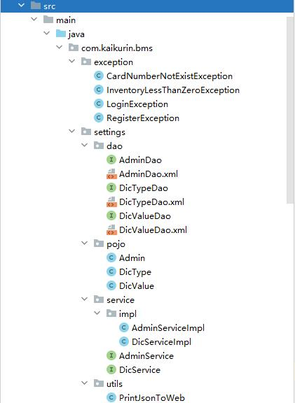
    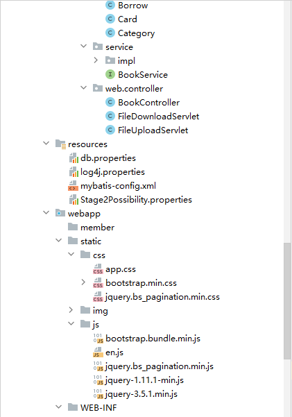
    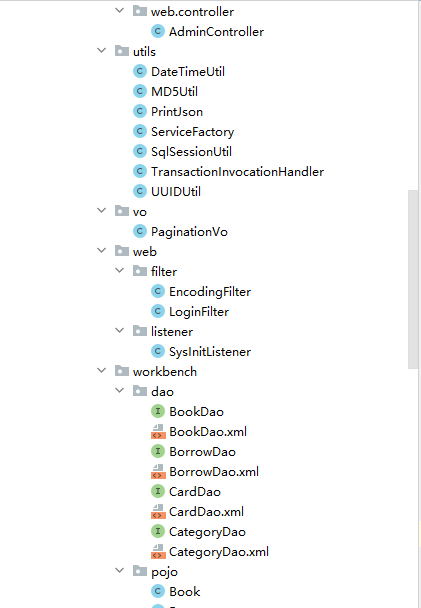
    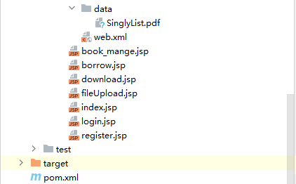
</div>

# 4. 各模块核心代码及测试
## 4.1. 核心代码简述及测试截图
说明：本项目几乎所有的前端与后端的数据交互都是通过ajax实现的（以JSON字符串的形式完成数据交互），以下主要介绍登录验证模块。
所以在项目中，后台向前台响应时都是通过编写的 PrintJson工具类返回json字符串，核心代码如下
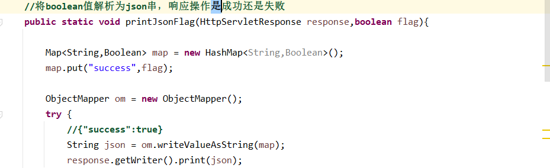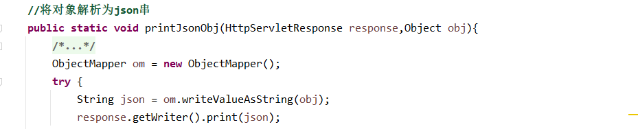
### 4.1.1 数据库连接
SqlSessionUtil工具类，可以通过该类的getSqlSession方法获取线程安全的SqlSession对象
```java
private SqlSessionUtil(){}

private static SqlSessionFactory factory;

static{
    try {
        factory = new SqlSessionFactoryBuilder().
        build(Resources.getResourceAsStream("mybatis-config.xml"));
    } catch (IOException e) {
        throw new RuntimeException(e);
    }
}

private static ThreadLocal<SqlSession> t = new ThreadLocal<SqlSession>();

public static SqlSession getSqlSession(){
    SqlSession session = t.get();
    if(session==null){
        session = factory.openSession();
        t.set(session);
    }
    return session;
}
// 通过动态代理模式关闭
public static void myClose(SqlSession session){
    if(session!=null){
        session.close();
        t.remove();
    }
}
```

### 4.1.2. 登陆验证模块
#### 登陆验证-表示层-前（Ajax）
当用户点击登陆时，先使用js对输入框的内容进行基本的筛选，如果数据正常再向后台发送 ajax 请求，如果登陆成功则进入主页，否则将相应错误信息打印在页面中。（为了方便，下方代码省略了表单等内容）
##### 登录验证
```js
// 用户点击登陆时
$("#loginBtn").click(function () {
    login();
})
function login() {
    //验证账号密码不能为空
    let username = $.trim($("#username").val());
    let loginPwd = $.trim($("#loginpwd").val());
    if(username=="" || loginPwd==""){
        $("#msg").html("账号密码不能为空");
        return false;
    }
    let flag = "";
    if($("#un-login").prop("checked")) {
        flag = "y";
    }
    $.ajax({
        url : "settings/admin/login.do",
        data : {
            "username" : username,
            "loginPwd" : loginPwd,
            "un-login" : flag
        },
        type : "post",
        dataType : "json",
        success : function (data) {
            if(data.success){
                window.location.href = "index.jsp";
            }else{
                $("#msg").html(data.msg);
            }
        }
    })
}
```
##### 获取后台存入的cookie，并实现免登录
在页面加载完毕后，页面会检测相关Cookie是否存在，如果存在则自动填入表单中，并登录。
```js
// 判断并实现免登录
let admin_Account = getCookie("admin_Account");
let password = getCookie("password");
if (admin_Account != null && password != null && admin_Account != "" && password != "") {
    $("#username").val(admin_Account);
    $("#loginpwd").val(password);
    login();
}

function getCookie(cookieName) {
    let cookieArr = decodeURIComponent(document.cookie).split('; ');
    for(let i = 0; i < cookieArr.length; i++) {
        let newArr = cookieArr[i].split('=');
        if (cookieName === newArr[0]) {
            return newArr[1];
        }
    }
    return null;
}
```
#### 登陆验证-表示层-后（添加cookie）
后台表示层获取到登陆表单中用户输入的用户名、密码以及判断用户是否勾选自动登录，若勾选，则添加cookie。之后将用户名和密码传入业务逻辑层，如果业务逻辑层返回用户不为空，则登陆成功。返回给前台登录成功的信息。
```java
/* 处理登陆操作 */
public void login(HttpServletRequest request, HttpServletResponse response) {

    String username = request.getParameter("username");
    String loginPwd = MD5Util.getMD5(request.getParameter("loginPwd"));
    String un_login = request.getParameter("un-login");
    AdminService as = (AdminService)ServiceFactory.getService(new AdminServiceImpl());
    try {
        Admin admin = as.login(username, loginPwd);
        // 执行至此处说明登陆成功，将admin信息出传入会话域中，并判断是否勾选免登录
        request.getSession().setAttribute("admin", admin);
        if("y".equals(un_login)) {
            System.out.println("用户勾选了免登录");
            Cookie cookie1 = new Cookie("admin_Account", username);
            Cookie cookie2 = new Cookie("password", request.getParameter("loginPwd"));
            cookie1.setMaxAge(60 * 60);
            cookie2.setMaxAge(60 * 60);
            cookie1.setPath(request.getContextPath());
            cookie2.setPath(request.getContextPath());
            response.addCookie(cookie1);
            response.addCookie(cookie2);
        }
        // 返回给前端登陆成功的信息
        PrintJson.printJsonFlag(response, true);
    }catch(LoginException e) {
        // 返回给前端登陆失败的信息
        PrintJsonToWeb.printExceptionToWeb(response, e);
    }

}
```

#### 登陆验证-业务逻辑层
业务逻辑层将数据交由Dao层查询，同样返回用户实体，如果不存在，则抛出 LoginException 自定义异常，由于动态代理的原因，在逻辑层抛出的异常会被表现层捕捉。
```java
private AdminDao adminDao = SqlSessionUtil.getSqlSession().getMapper(AdminDao.class);
public Admin login(String username, String loginPwd) throws LoginException {
    HashMap<String, String> map = new HashMap<>();
    map.put("admin_Account", username);
    map.put("password", loginPwd);
    Admin admin = adminDao.login(map);
    if(admin == null) {
        throw new LoginException("账号密码错误");
    }
    return admin;
}
```
#### 登陆验证-数据交互层
由于在数据交互层处理数据使用的时mybatis，所以只需要编写相应的Dao接口类，具体sql语句则在配置文件中编写。
##### adminDao.java
```java
public interface AdminDao {
    Admin login(HashMap<String, String> map);
}
```
##### adminDao.xml
```xml
<select id="login" resultType="Admin">
    select
        id,
        admin_name,
        sex,
        phone,
        admin_Account,
        password
    from t_admin
    where admin_Account=#{admin_Account} and password=#{password}
</select>
```
#### 过滤器-验证用户是否登录
该过滤器为了验证用户是否已经登录过，主要是防止外部的恶意访问。
这里过滤掉除了登录和注册以外的所有相关操作
```java
public void doFilter(ServletRequest req, ServletResponse resp, FilterChain chain)
            throws IOException, ServletException {
    HttpServletRequest request = (HttpServletRequest)req;
    HttpServletResponse response = (HttpServletResponse)resp;
    String path = request.getServletPath();
    if("/login.jsp".equals(path) || "/settings/admin/login.do".equals(path) ||
            "/register.jsp".equals(path) || "/settings/admin/register.do".equals(path)) {
        chain.doFilter(req, resp);
    }else {
        Admin admin = (Admin)request.getSession().getAttribute("admin");
        if(admin != null) {
            chain.doFilter(req, resp);
        }else {
            response.sendRedirect(request.getContextPath() + "/login.jsp");
        }
    }
}
```

##### 测试截图
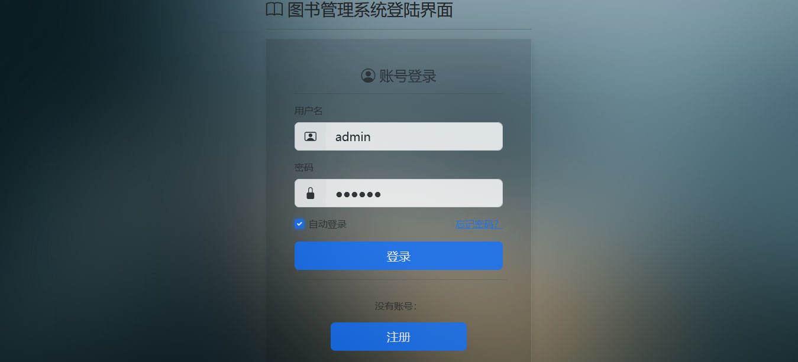

### 4.1.3. 注册模块
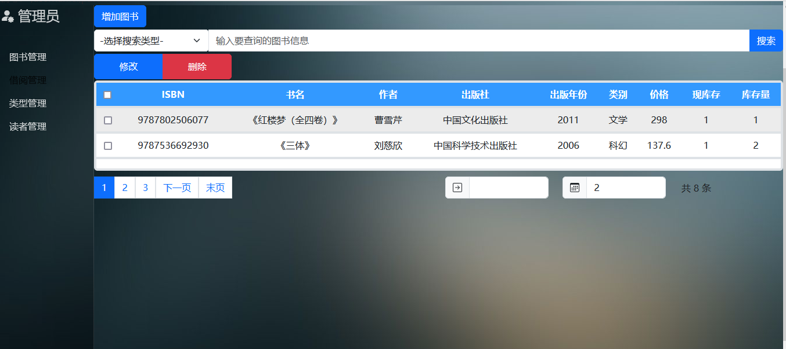
#### 前端代码
```js
$.ajax({
    url : "settings/admin/register.do",
    data : {
        "realName" : realName,
        "sex" : sex,
        "phone" : phone,
        "userName" : userName,
        "password" : password,
        "power" : power
    },
    type : "post",
    dataType : "json",
    success : function (data) {
        if(data.success){
            if(window.confirm("注册成功")){
                window.location.href = "login.jsp";
            }
        }else{
            $("#userNameMsg").html(data.msg);
        }
    }
})
```

#### 后端核心代码
```java
/* 处理用户注册操作 */
public void register(HttpServletRequest request, HttpServletResponse response) {

    String realName = request.getParameter("realName");
    String sex = request.getParameter("sex");
    String phone = request.getParameter("phone");
    String userName = request.getParameter("userName");
    String password = MD5Util.getMD5(request.getParameter("password"));
    String power = request.getParameter("power");
    AdminService as = (AdminService)ServiceFactory.getService(new AdminServiceImpl());
    if("admin".equals(power)) {
        Admin admin = new Admin();
        admin.setId(UUIDUtil.getUUID());
        admin.setAdmin_name(realName);
        admin.setSex("man".equals(sex) ? "男":"女");
        admin.setPhone(phone);
        admin.setAdmin_Account(userName);
        admin.setPassword(password);
        try {
            int count = as.register(admin, userName);
            // 执行至此处说明注册成功
            PrintJson.printJsonFlag(response, true);
        } catch(RegisterException e) {
            // 返回给前端用户名重复的信息
            PrintJsonToWeb.printExceptionToWeb(response, e);
        }
    }

}
```

```java
public int register(Admin admin, String Admin_Account) 
        throws RegisterException {
    Admin selectAdmin = adminDao.selectByAdmin_Account(Admin_Account);
    if(selectAdmin != null) {
        throw new RegisterException("账号已存在");
    }
    int count = adminDao.register(admin);
    return count;
}
```
```xml
<insert id="register">
    insert into t_admin(
        id,
        admin_name,
        sex,
        phone,
        admin_Account,
        password)
    values(
        #{id},
        #{admin_name},
        #{sex},
        #{phone},
        #{admin_Account},
        #{password}
    )
</insert>
```
#### 测试截图
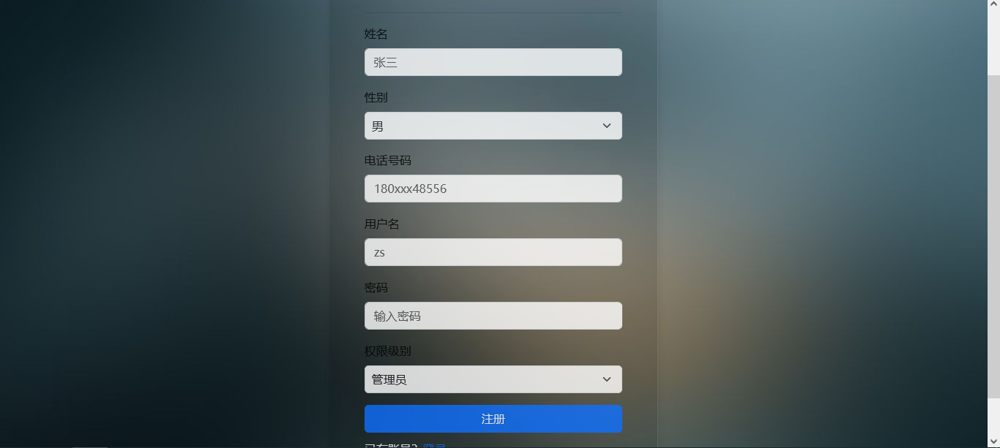
### 4.1.4 图书管理模块
由于代码量太大，且大量重复，这里就只贴 添加 操作的代码了
##### 前端核心代码 
```js
$("#saveBtn").click(function() {
    let year = $.trim($("#add_year").val());
    if(!validateYear(year)) {
        alert("年份不合法！！！")
        return false;
    }
    $.ajax({
        url : "workbench/bookmange/save.do",
        data : {
            ISBN : $.trim($("#add_isbn").val()),
            book_Name : $.trim($("#add_bookname").val()),
            author : $.trim($("#add_author").val()),
            publisher : $.trim($("#add_publisher").val()),
            year : year,
            type : $.trim($("#add_select").val()),
            price : $.trim($("#add_price").val()),
            total_Inventory : $.trim($("#add_totalinventory").val())
        },
        type : "post",
        dataType : "json",
        success : function (data) {
            if(data.success) {
                $("#addBook_Modal").modal("hide");
                pageList(1,$("#bookPage").bs_pagination('getOption', 'rowsPerPage'));
                $("#addForm")[0].reset();
            }else {
                alert("添加失败")
            }
        }

    })
})
```            
##### 后端核心代码 
```java
private void save(HttpServletRequest request, HttpServletResponse response) {
    // getBookByRequest 是一个私有的工具类，根据请求内容返回一个图书对象
    Book book = getBookByRequest(request);
    book.setId(UUIDUtil.getUUID());
    book.setCurrent_Inventory(book.getTotal_Inventory());

    BookService bs = (BookService)ServiceFactory.getService(new BookServiceImpl());
    boolean flag = bs.save(book);
    PrintJson.printJsonFlag(response, flag);

}
```
```java
public boolean save(Book book) {
    boolean flag = true;
    int count = bookDao.save(book);
    if(count != 1) {
        flag = false;
    }
    return flag;
}
```
```xml
<insert id="save">
    insert into t_book(
        id,
        ISBN,
        book_Name,
        author,
        publisher,
        year,
        type,
        price,
        current_Inventory,
        total_Inventory
    )
    values(
        #{id},
        #{ISBN},
        #{book_Name},
        #{author},
        #{publisher},
        #{year},
        #{type},
        #{price},
        #{current_Inventory},
        #{total_Inventory}
    )
</insert>
```
##### 测试截图 
##### 添加
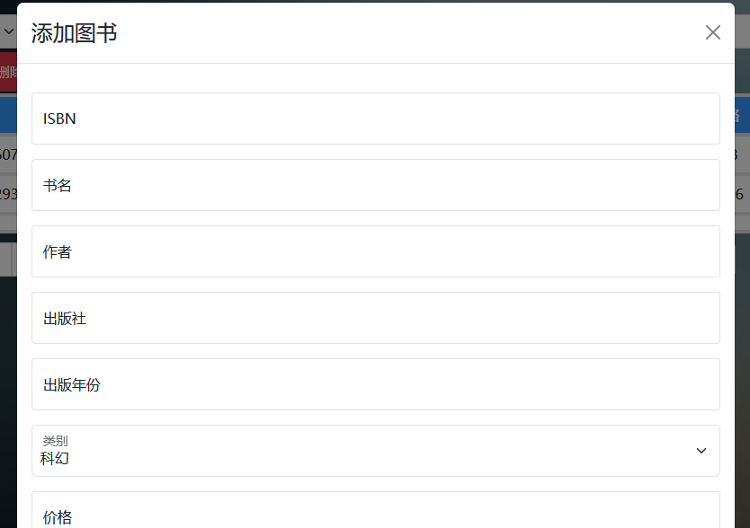
##### 查询
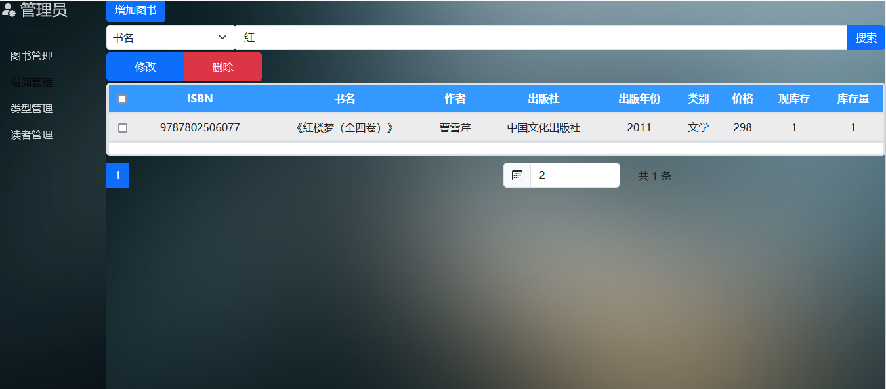
##### 编辑
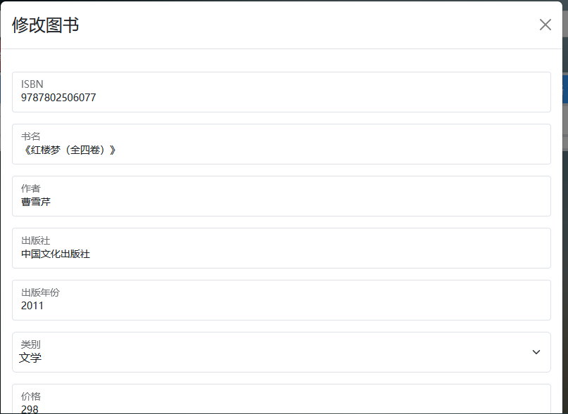

### 4.1.5 补充
#### 清除Cookie（退出操作）
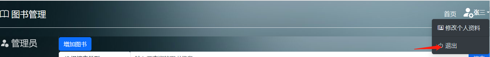
当用户点击退出时，清除相关Cookie，并返回至登录页面
前端处理Cookie
```js
$("#logOut").click(function() {
    deleteCookies("admin_Account");
    deleteCookies("password");
    window.location.href = "settings/admin/logOut.do"
})

function deleteCookies(names) {
    if (typeof names === 'string') {
        names = [names];
    }
    for (const name of names) {
        document.cookie = name + '=;expires=Thu, 01 Jan 1970 00:00:01 GMT;';
    }
}
```
后端处理会话
```java
/*
* 处理退出操作
* 销毁会话
*/
public void logOut(HttpServletRequest request, HttpServletResponse response) 
        throws IOException {
    request.getSession().invalidate();
    response.sendRedirect(request.getContextPath() + "/login.jsp");
}
```

#### 过滤器-防止乱码
```java
public void doFilter(ServletRequest req, ServletResponse resp, FilterChain chain)
        throws IOException, ServletException {
    req.setCharacterEncoding("UTF-8");
    resp.setContentType("text/html;charset=utf-8");
    chain.doFilter(req, resp);
}
```

#### 监听器
这段Java代码是一个监听器 ServletContextListener 的实现，在 ServletContext 初始化时，将应用需要的数据字典和阶段和可能性的键值对保存到服务器缓存中，以便后面的请求能够直接从缓存获取相应数据而不用频繁从数据库或文件中读取。
```java
public void contextInitialized(ServletContextEvent event) {

    System.out.println("服务器缓存处理数据字典开始");
    ServletContext application = event.getServletContext();
    DicService ds = (DicService) ServiceFactory.getService(new DicServiceImpl());
    Map<String, List<DicValue>> map = ds.getAll();
    //将map解析为上下文域对象中保存的键值对
    Set<String> set = map.keySet();
    for(String key:set){
        application.setAttribute(key, map.get(key));
    }
    System.out.println("服务器缓存处理数据字典结束");

    //数据字典处理完毕后，处理Stage2Possibility.properties文件
    //解析properties文件
    Map<String,String> pMap = new HashMap<String,String>();
    ResourceBundle rb = ResourceBundle.getBundle("Stage2Possibility");
    Enumeration<String> e = rb.getKeys();
        while (e.hasMoreElements()){
        //阶段
        String key = e.nextElement();
        //可能性
        String value = rb.getString(key);
        pMap.put(key, value);
    }
```
```java
    //将pMap保存到服务器缓存中
    application.setAttribute("pMap", pMap);
}
```

#### El表达式
##### base标签
设置整个网页的基础路径，在当前页面中，凡是路径没有以“/”开始的，都会自动将base中的路径添加到这些路径之前
```html
<base href="${pageContext.request.scheme}://${pageContext.request.serverName}:
${pageContext.request.serverPort}${pageContext.request.contextPath}/">
```
##### 动态获取用户的名字
```html
<a href="#" id="dropdownUser1">
    <strong>${admin.admin_name}</strong>
</a>
```
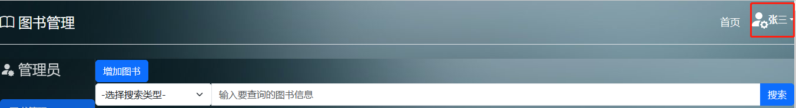
##### 获取web.xml中的全局配置值
展示图书列表时，考虑到图书数量的问题，所以，在前端实现了分页功能。部分代码如下
```js
// 页面加载时自动调用
pageList(${pageNo}, ${pageSize});
/*
* pageNo: 页码
* pageSize: 每页展示的记录数
*/
function pageList(pageNo, pageSize) {
// 此处省略
}
```
```xml
<context-param>
    <param-name>pageNo</param-name>
    <param-value>1</param-value>
</context-param>
<context-param>
    <param-name>pageSize</param-name>
    <param-value>2</param-value>
</context-param>
```

#### 文件上传操作
```java
@WebServlet("/fileUpload.do")
@MultipartConfig(fileSizeThreshold = 1024)
public class FileUploadServlet extends HttpServlet {
    
    private String getFilename(Part part) {
        String fname = null;
        String header = part.getHeader("content-disposition");
        fname = header.substring(header.lastIndexOf("=") + 2,
                header.length() - 1);
        return fname;
    }

    public void doPost(HttpServletRequest request,
                       HttpServletResponse response)
            throws ServletException, IOException {
        String path = this.getServletContext().getRealPath("/");
        Part p = request.getPart("fileName");
        String message = "";
        if (p.getSize() > 1024 * 1024) {    // 上传的文件不能超过1MB大小
            p.delete();
            message = "文件太大，不能上传！";
        } else {
            // 文件存储在文档根目录下的member中
            path += "member";
            System.out.println("path = " + path);
            File f = new File(path);
            System.out.println("f = " + f);
            if (!f.exists()) {  // 若目录不存在，则创建目录
                f.mkdirs();
            }
            String fname = getFilename(p);   // 得到文件名
            System.out.println(fname);
            p.write(path + "/" + fname);     // 将上传的文件写入磁盘
            message = "文件上传成功！";
        }
        request.setAttribute("message", message);
        RequestDispatcher rd = request.getRequestDispatcher("fileUpload.jsp");
        rd.forward(request, response);
    }
}
```

#### 文件下载操作
```java
public void doGet(HttpServletRequest request,
                      HttpServletResponse response)
            throws ServletException, IOException {

    HttpSession session = request.getSession();
    String dataDirectory = request.getServletContext().getRealPath("/WEB-INF/data");
    File file = new File(dataDirectory, "SinglyList.pdf");
    if (file.exists()) {
        // 设置响应的内容类型为PDF文件
        response.setContentType("application/pdf");
        response.addHeader("Content-Disposition", 
        "attachment;filename=java.pdf");
        byte[] buffer = new byte[1024];
        FileInputStream fis = null;
        BufferedInputStream bis = null;
        try {
            fis = new FileInputStream(file);
            bis = new BufferedInputStream(fis);
            OutputStream os = response.getOutputStream();
            // 读取1K的字节
            int i = bis.read(buffer);
            while (i != -1) {
                os.write(buffer, 0, i);
                i = bis.read(buffer);
            }
        } catch (IOException ex) {
            System.out.println(ex);
        } finally {
            if (bis != null) {
                bis.close();
            }
            if (fis != null) {
                fis.close();
            }
        }
    } else {
        response.setContentType("text/html;charset=UTF-8");
        PrintWriter out = response.getWriter();
        out.println("文件不存在！");
    }
}
```

# 5. 项目开发实现小结
目前的图书管理系统虽然处于开发阶段，但已经通过框架实现了一些关键功能。
（1）采用三层架构模式使得不同的功能组件之间的耦合度降低，便于后续修改和添加新功能。
（2）使用了 MyBatis 框架，通过配置文件进行数据库连接和 SQL 语句的映射，简化了数据库操作和避免了 SQL 注入攻击以及避免了频繁查询数据库带来的性能影响。
（3）使用大量js脚本处理前端业务，加快客户端页面的响应速度，并提高前端页面的美观性和事件处理机制优化，借助jQuery框架开发前端页面更加简洁易懂。
（4）使用了大量的ajax，大大加快前端页面响应速度，优化用户体验。比如，在读者图书查询模块中，通过异步获取数据和更新页面，可以使得用户能够实时查询到库存图书信息，方便用户查询；为了保证系统性能和可维护性，由于需要处理大量数据的分页显示，采用Ajax分页技术，减少服务器负担和网络传输成本。
（5）本项目还使用 Bootstrap 前端 UI 框架，在前端页面中引入一些样式，简化前端开发流程，同时提供丰富的组件和交互效果来改善用户体验。

<p class="p">
未来系统将会重点实现其他尚未实现的功能如增加读者选购，推荐功能，同时改进后端使用SSM框架，简化代码，提高系统可维护性和扩展性。此外，前端也会有所优化，为用户提供更加方便的登陆方式与选择，以及改善相关的界面设计。在连接数据库方面，也可以通过减少SQL语句、优化DataSource、完善并发编程和锁机制等方法提高系统的性能和效率。
</p>
<p class="p">
此外，在未来的图书管理系统中，根据自己将要学习的内容可以考虑引入一些人工智能算法和技术。例如，利用机器学习算法进行读者喜好预测和推荐书籍，或者使用自然语言处理技术来提高搜索、查询等功能的效率和精度。同时，还可以考虑实现图书借阅管理的移动化，开发适配不同平台（手机端、平板电脑等）的客户端应用程序，方便读者随时随地查找和借阅图书。最后，为了确保系统的安全性，还需要加强对数据的加密和保护措施，严格控制权限和访问，避免出现安全漏洞。
</p>